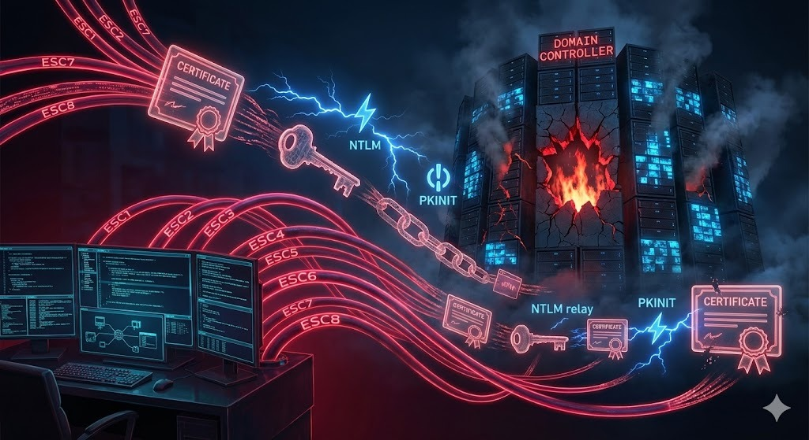

# ADCS Attack Range




[](https://www.vagrantup.com/)
[](https://www.virtualbox.org/)
[](https://docs.microsoft.com/en-us/powershell/)


A modular experimentation lab for **Active Directory Certificate Services (AD CS)** vulnerabilities.
This project allows you to spin up isolated, reproducible environments for **ESC1 through ESC8** attacks using Vagrant and VirtualBox.

> **⚠️ WARNING**: These labs contain intentionally vulnerable configurations. **DO NOT** deploy this on a public network or production environment.

> **💡 DESIGN PHILOSOPHY**: **Automated Infrastructure, Manual Vulnerability**.
> While the heavy lifting of deploying AD, DNS... is fully automated, many specific misconfigurations (like enabling vulnerable templates or weak ACLs) are designed as **manual steps**. This ensures you understand exactly *how* the vulnerability is created, rather than just exploiting a black box.

---

## 🎯 Labs Available

Each lab is a self-contained environment (DC + Client) focusing on a specific vulnerability class.

| Lab | Vulnerability | Technique |
|:---:|:--------------|:----------|
| **[ESC1](./adcs-esc1-lab)** | Domain escalation via No Issuance Requirements + Enrollable Client Authentication/Smart Card Logon OID + `CT_FLAG_ENROLLEE_SUPPLIES_SUBJECT` | **Domain Escalation** |
| **[ESC2](./adcs-esc2-lab)** | Domain escalation via No Issuance Requirements + Enrollable `Any Purpose` EKU or `No EKU` | **Persistence / Evasion** |
| **[ESC3](./adcs-esc3-lab)** | Domain escalation via No Issuance Requirements + `Certificate Request Agent` EKU + No enrollment agent restrictions | **Domain Escalation** |
| **[ESC4](./adcs-esc4-lab)** | Domain escalation via misconfigured certificate template access control | **Template Injection** |
| **[ESC5](./adcs-esc5-lab)** | Domain escalation via vulnerable PKI AD Object Access Control | **Infrastructure Compromise** |
| **[ESC6](./adcs-esc6-lab)** | Domain escalation via `EDITF_ATTRIBUTESUBJECTALTNAME2` on CA + No Manager Approval + Enrollable Client Authentication | **Domain Escalation** |
| **[ESC7](./adcs-esc7-lab)** | Vulnerable Certificate Authority Access Control | **CA Reconfiguration** |
| **[ESC8](./adcs-esc8-lab)** | NTLM Relay to AD CS HTTP Endpoints | **Credential Theft** |

---

## 🛠️ Prerequisites

*   **Host OS**: Windows, macOS, or Linux (Scripts are PowerShell-based, tested on Windows).
*   **Virtualization**: [VirtualBox 7.x](https://www.virtualbox.org/wiki/Downloads) + Extension Pack.
*   **Orchestration**: [Vagrant 2.3+](https://www.vagrantup.com/downloads).
*   **Resources**: Approx. 12GB RAM and 40GB Disk per active lab.

---

## 🚀 Getting Started

1.  **Clone the Repository**:
    ```bash
    git clone https://github.com/Cxnrvd/ADCS-Attack-Range
    cd ADCS-Attack-Range
    ```

2.  **Choose a Lab**:
    Navigate to the directory of the vulnerability you want to study.
    ```powershell
    cd adcs-esc1-lab
    ```

3.  **Deploy**:
    Run Vagrant to build the Domain Controller and Client.
    ```powershell
    vagrant up
    ```
    *Provisioning typically takes 10-15 minutes.*

4.  **Attack**:
    Follow the `README.md` inside each lab folder for specific attack walkthroughs.

5.  **Destroy**:
    When finished, save resources by destroying the lab.
    ```powershell
    vagrant destroy -f
    ```

---

## 🏗️ Architecture

All labs follow a consistent "Split-Provisioning" architecture for stability:

*   **Domain**: `adcs.local`
*   **Network**: 192.168.57.0/24 (Host-Only / Private)
*   **Base Box**: `mayfly/windows_server2019` & `mayfly/windows10`
*   **Credentials**:
    *   **Admin**: `Administrator` / `P@ssw0rd!123`
    *   **User**: `johndoe` / `Summer2024!`

---

## 📚 References

*   **Certified Pre-Owned**: [SpecterOps Whitepaper](https://specterops.io/wp-content/uploads/sites/3/2022/06/Certified_Pre-Owned.pdf)

---

**Disclaimer**: This project is for educational purposes and authorized testing only. The author is not responsible for any misuse.
